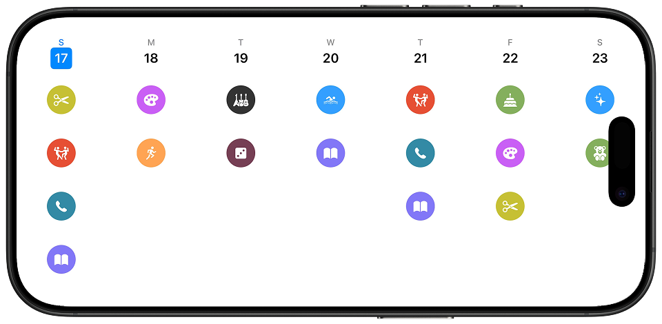
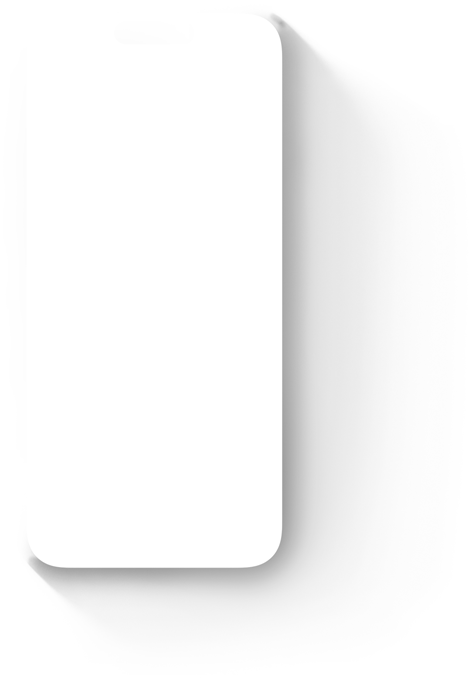
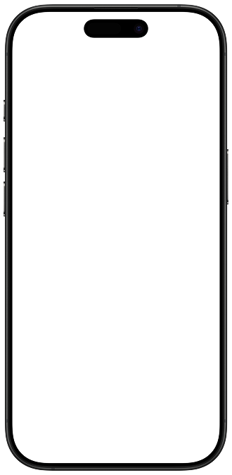

<section class="hero">
    

        <picture class="app-icon">
            <source srcset="Images/logo.png, Images/logo@2x.png 2x">
            
        </picture>
        <h3 class="app-name font-semibold">OYMI</h3>
        <h1>Get it out of your head.</h1>
        
Say it out loud — and keep what matters.

        <a href="#" class="btn btn-primary">
            Join the waitlist
        </a>
    

    

        

            <picture class="hero-shadow">
                <source srcset="Images/hero/hero_img_shadow_small.png, Images/hero/hero_img_shadow_small@2x.png 2x" media="(max-width:734px)">
                <source srcset="Images/hero/hero_img_shadow_medium.png, Images/hero/hero_img_shadow_medium@2x.png 2x" media="(max-width:1068px)">
                <source srcset="Images/hero/hero_img_shadow_large.png, Images/hero/hero_img_shadow_large@2x.png 2x" media="(min-width:0px)">
                
            </picture>
            <picture class="hero-device">
                <source srcset="Images/hero/hero_img_small.png, Images/hero/hero_img_small@2x.png 2x" media="(max-width:734px)">
                <source srcset="Images/hero/hero_img_medium.png, Images/hero/hero_img_medium@2x.png 2x" media="(max-width:1068px)">
                <source srcset="Images/hero/hero_img_large.png, Images/hero/hero_img_large@2x.png 2x" media="(min-width:0px)">
                
            </picture>
        

    

</section>

<section class="features" id="features">
    

        

            

                <h2>Speak instead of type</h2>
                
Tap once and start talking. OYMI captures your thoughts as you speak — no blank page to stare at, no slow typing getting in the way. Just your voice, recorded and ready.

            

            

                

                        <picture class="iphone-shadow">
                            <source srcset="Images/bezels/shadow_small.png, Images/bezels/shadow_small@2x.png 2x" media="(max-width:734px)">
                            <source srcset="Images/bezels/shadow_medium.png, Images/bezels/shadow_medium@2x.png 2x" media="(max-width:1068px)">
                            <source srcset="Images/bezels/shadow_large.png, Images/bezels/shadow_large@2x.png 2x" media="(min-width:0px)">
                            
                        </picture>
                        <picture class="iphone-screen">
                            <source srcset="Images/features/feature_record_small.png, Images/features/feature_record_small@2x.png 2x" media="(max-width:734px)">
                            <source srcset="Images/features/feature_record_medium.png, Images/features/feature_record_medium@2x.png 2x" media="(max-width:1068px)">
                            <source srcset="Images/features/feature_record_large.png, Images/features/feature_record_large@2x.png 2x" media="(min-width:0px)">
                            
                        </picture>
                        <picture class="iphone-hardware">
                            <source srcset="Images/bezels/bezel_small.png, Images/bezels/bezel_small@2x.png 2x" media="(max-width:734px)">
                            <source srcset="Images/bezels/bezel_medium.png, Images/bezels/bezel_medium@2x.png 2x" media="(max-width:1068px)">
                            <source srcset="Images/bezels/bezel_large.png, Images/bezels/bezel_large@2x.png 2x" media="(min-width:0px)">
                            
                        </picture>
                

            

        

        

            

                <h2>Your voice, captured as text</h2>
                
Just your voice, turned into text you can read and edit whenever you want.

            

            

                

                        <picture class="iphone-shadow">
                            <source srcset="Images/bezels/shadow_small.png, Images/bezels/shadow_small@2x.png 2x" media="(max-width:734px)">
                            <source srcset="Images/bezels/shadow_medium.png, Images/bezels/shadow_medium@2x.png 2x" media="(max-width:1068px)">
                            <source srcset="Images/bezels/shadow_large.png, Images/bezels/shadow_large@2x.png 2x" media="(min-width:0px)">
                            
                        </picture>
                        <picture class="iphone-screen">
                            <source srcset="Images/features/feature_insight_small.png, Images/features/feature_insight_small@2x.png 2x" media="(max-width:734px)">
                            <source srcset="Images/features/feature_insight_medium.png, Images/features/feature_insight_medium@2x.png 2x" media="(max-width:1068px)">
                            <source srcset="Images/features/feature_insight_large.png, Images/features/feature_insight_large@2x.png 2x" media="(min-width:0px)">
                            
                        </picture>
                        <picture class="iphone-hardware">
                            <source srcset="Images/bezels/bezel_small.png, Images/bezels/bezel_small@2x.png 2x" media="(max-width:734px)">
                            <source srcset="Images/bezels/bezel_medium.png, Images/bezels/bezel_medium@2x.png 2x" media="(max-width:1068px)">
                            <source srcset="Images/bezels/bezel_large.png, Images/bezels/bezel_large@2x.png 2x" media="(min-width:0px)">
                            
                        </picture>
                

            

        

        

            

                <h2>Transcription stays on your device</h2>
                
Transcription happens entirely on your device. Your recordings are not sent to a server for processing.

            

            

                

                        <picture class="iphone-shadow">
                            <source srcset="Images/bezels/shadow_small.png, Images/bezels/shadow_small@2x.png 2x" media="(max-width:734px)">
                            <source srcset="Images/bezels/shadow_medium.png, Images/bezels/shadow_medium@2x.png 2x" media="(max-width:1068px)">
                            <source srcset="Images/bezels/shadow_large.png, Images/bezels/shadow_large@2x.png 2x" media="(min-width:0px)">
                            
                        </picture>
                        <picture class="iphone-screen">
                            <source srcset="Images/features/feature_privacy_small.png, Images/features/feature_privacy_small@2x.png 2x" media="(max-width:734px)">
                            <source srcset="Images/features/feature_privacy_medium.png, Images/features/feature_privacy_medium@2x.png 2x" media="(max-width:1068px)">
                            <source srcset="Images/features/feature_privacy_large.png, Images/features/feature_privacy_large@2x.png 2x" media="(min-width:0px)">
                            
                        </picture>
                        <picture class="iphone-hardware">
                            <source srcset="Images/bezels/bezel_small.png, Images/bezels/bezel_small@2x.png 2x" media="(max-width:734px)">
                            <source srcset="Images/bezels/bezel_medium.png, Images/bezels/bezel_medium@2x.png 2x" media="(max-width:1068px)">
                            <source srcset="Images/bezels/bezel_large.png, Images/bezels/bezel_large@2x.png 2x" media="(min-width:0px)">
                            
                        </picture>
                

            

        

        

            

                <h2>Build a habit that lasts</h2>
                
Record when it suits you — morning, commute, or end of day. Browse your past entries any time, return to old thoughts, and let the habit grow naturally at your own pace.

            

            

                

                        <picture class="iphone-shadow">
                            <source srcset="Images/bezels/shadow_small.png, Images/bezels/shadow_small@2x.png 2x" media="(max-width:734px)">
                            <source srcset="Images/bezels/shadow_medium.png, Images/bezels/shadow_medium@2x.png 2x" media="(max-width:1068px)">
                            <source srcset="Images/bezels/shadow_large.png, Images/bezels/shadow_large@2x.png 2x" media="(min-width:0px)">
                            
                        </picture>
                        <picture class="iphone-screen">
                            <source srcset="Images/features/feature_entries_small.png, Images/features/feature_entries_small@2x.png 2x" media="(max-width:734px)">
                            <source srcset="Images/features/feature_entries_medium.png, Images/features/feature_entries_medium@2x.png 2x" media="(max-width:1068px)">
                            <source srcset="Images/features/feature_entries_large.png, Images/features/feature_entries_large@2x.png 2x" media="(min-width:0px)">
                            
                        </picture>
                        <picture class="iphone-hardware">
                            <source srcset="Images/bezels/bezel_small.png, Images/bezels/bezel_small@2x.png 2x" media="(max-width:734px)">
                            <source srcset="Images/bezels/bezel_medium.png, Images/bezels/bezel_medium@2x.png 2x" media="(max-width:1068px)">
                            <source srcset="Images/bezels/bezel_large.png, Images/bezels/bezel_large@2x.png 2x" media="(min-width:0px)">
                            
                        </picture>
                

            

        

    

</section>

<section class="how-it-works" id="how-it-works">
    

        <h2>How it works</h2>
        

            

                
1

                <h3>Tap to record</h3>
                
Open the app and press record. No setup, no friction. You're ready to speak in seconds.

            

            

                
2

                <h3>Speak freely</h3>
                
Talk about your day, your feelings, whatever is on your mind. OYMI listens without judgment.

            

            

                
3

                <h3>See what you said</h3>
                
Your words, captured as text. Come back to them whenever you want.

            

        

    

</section>

<section class="cta">
    

        <h2>Be the first to try OYMI.</h2>
        <a href="#" class="btn btn-primary">
            Get early access
        </a>
    

</section>
